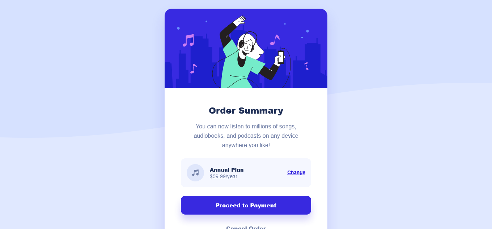

# Frontend Mentor - Order summary card solution

This is a solution to the [Order summary card challenge on Frontend Mentor](https://www.frontendmentor.io/challenges/order-summary-component-QlPmajDUj). Frontend Mentor challenges help you improve your coding skills by building realistic projects. 

## Table of contents

- [Overview](#overview)
  - [The challenge](#the-challenge)
  - [Screenshot](#screenshot)
  - [Links](#links)
- [My process](#my-process)
  - [Built with](#built-with)
  - [What I learned](#what-i-learned)
- [Author](#author)
- [Acknowledgments](#acknowledgments)

## Overview

### The challenge

Users should be able to:

- View the optimal layout for the page depending on their device's screen size
- See hover states for interactive elements

### Screenshot



### Links

- Solution URL: [https://github.com/eneasdutra/order-summary-component-main](https://github.com/eneasdutra/order-summary-component-main)
- Live Site URL: [https://eneasdutra.github.io/order-summary-component-main/](https://eneasdutra.github.io/order-summary-component-main/)

## My process

### Built with

- **HTML5** semantics
- Custom **CSS properties (Variables)**
- **HSL** color formatting
- **Flexbox** for centering and layout
- **Mobile-first** methodology
- **Accessibility** (use of semantic frameworks and ARIA labels)

### What I learned

In this project, I focused on applying good accessibility practices and color organization. The use of HSL facilitated the creation of more precise hover states.

To see how you can add code snippets, see below:

```css
/* Exemplo de uso de variáveis HSL para melhor manutenção */
:root {
  --bright-blue: hsl(245, 75%, 52%);
  --bright-blue-hover: hsl(245, 83%, 68%);
}
```
I also reinforced the Mobile-First concept, ensuring that the site loads smoothly on smaller devices before applying desktop rules via Media Queries.

## Author

- Frontend Mentor - [@eneasdutra](https://www.frontendmentor.io/profile/eneasdutra)
- Linkedin - [@eneasmdutra](https://www.linkedin.com/in/eneasmdutra/)
- Github - [@eneasdutra](https://github.com/eneasdutra)

## Acknowledgments

I thank the Frontend Mentor team for providing such inspiring designs for practice.
